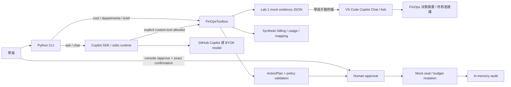
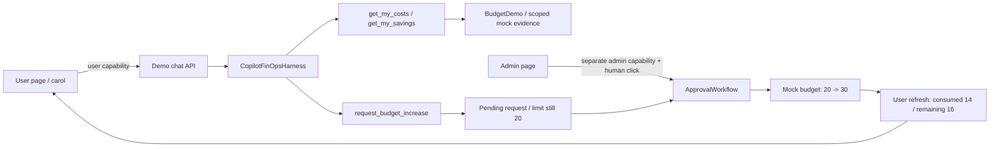
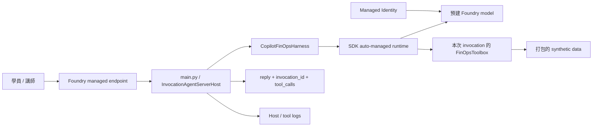

# FinOps Agent 架構與信任邊界

**Copilot SDK 是 Agent harness；Foundry Model 是可替換的模型來源，Foundry Agent Service 則是選配 hosting。** 本機可先切換模型，不需部署 Agent。Direct code deployment 不需要維護自訂 Dockerfile、sidecar 或 CLI TCP server；SDK 仍會自管其必要的 runtime process，並非完全移除了 runtime。

## 本機：先用現成工具分析，再讓 SDK 選擇工具

Lab 1 的現成 deterministic CLI 不載入 Copilot 或 Azure client；只需要 Python 與 fixture。`brief` 將既有報表工具輸出收集為 read-only JSON，學員再手動附到 VS Code Copilot Chat 分析。Lab 2 透過 `demo_connection.py` 將預建個人 tools 接到同一個 SDK harness。上圖的通用 CLI `ask` / `chat` 和 seat 操作是進階範例，不再是 Lab 2 必做。

## Lab 1 選做 dashboard：本機檔案，不是新服務

核心交付仍是 Copilot Chat **Ask** 分析後的一頁決策摘要。選做時才切到 VS Code **Agent** 模式，根據同一份 mock evidence 提議建立 `workshop-output/finops-dashboard.html`；學員檢視 edits 後接受，再手動開啟。這不經過 Lab 2 的 SDK harness，也不新增 Lab、source checkpoint 或管理服務。

頁面只用瀏覽器 **File API** 讀使用者選取的 JSON，資料只留在頁面記憶體。單一 HTML/CSS/JS 可直接用 `file://` 開啟，沒有 `fetch`、外部網路呼叫、CDN、backend、登入或 persistence；建立檔案沿用 VS Code Copilot 登入，瀏覽器不持有 API key。Repo source 與 `.env` 不在可編輯範圍，結果不自動執行或上傳。

`starter/src/finops_agent/demo.html` 僅供唯讀參考完整 Clawpilot `--cp-*` 變數、light/dark 機制與 Segoe UI 字體，不複製其 admin／API 行為。Dashboard 不提供 seat／budget 變更按鈕或 approval tools；JSON 字串以 `textContent` 呈現，不送進 `innerHTML`。空白狀態、schema／加總錯誤與未知日期都要明確顯示，圖表另附表格與鍵盤可用的控制項。

新版 `brief` 為 `schema_version=2`，`daily_usage.items` 只有 `date`、`net_quantity`、`net_amount`，credits／USD 分別加總回 `cost_summary`。部門與模型排行來自 `department_ranking.ranking`、`model_breakdown.items`，保留 `Unallocated`；日彙總不含這些維度，不能做臆造的部門／模型每日 cross-filter。Budget、seat 與 run-rate scenario 分區呈現，不共享或互相覆蓋 consumed／remaining。

## Lab 2：個人 FinOps 與管理者核准

`BudgetDemo` 將 user 固定在伺服器端；model 沒有任意 username、plan payload 或 approve 參數。`get_my_costs` 只回傳 carol 的 billing、budget 與申請；`get_my_savings` 只使用她的 evidence。管理者核准是另一個 HTTP endpoint，不是 LLM tool。

`demo_server.py` 只綁 localhost，產生不同的 user/admin capabilities，以 request header 驗證；更改 UI role 不會繞過伺服器檢查。這是單一機器的角色扮演，並非 production 登入或多租戶 RBAC。持有 admin link 代表管理者，因此不要公布該連結或把頁面公開。

同一個 demo process 保留 SDK conversation、mock budgets、pending requests；頁面輪詢只讀這些資料，不重新呼叫模型。核准前不改額度，核准後不重設 consumed；重複核准不再次執行，過時的 budget snapshot 拒絕核准。退出程序後一切重設。

`demo.html` 沒有前端 build 或外部 CDN；「直接提交 mock 申請」是明確標示、不經模型的備援，不是默默替代 SDK 問答。Lab 3 模型切換沿用這個本機 UI；選配 Hosted 部署不包含 UI 或 approval API。

## Foundry Model：只替換推論來源

`FINOPS_MODEL_PROVIDER` 的三條路徑都由既有 `CopilotFinOpsHarness` 管理，沒有新增 Toolbox／MCP 連線。`copilot` 使用 `COPILOT_GITHUB_TOKEN`／`COPILOT_MODEL`，是 Lab 1/2 的 Azure-free 主線。Foundry 則統一讀取 `AZURE_OPENAI_ENDPOINT`／`MODEL_NAME`：key 模式另需 `AZURE_OPENAI_API_KEY`；identity 模式不用 key，透過非同步 bearer-token callback，在本機使用開發者憑證、Hosted 使用 Managed Identity。

Endpoint 可以是 resource/project 根網址，或已包含 `/openai/v1/` 的 base URL；harness 只補一次 v1 路徑。Hosted 的 `MODEL_NAME` 由 azd deployment 變數對應，未指定 endpoint 時保留平台注入的 project endpoint 作為來源。舊 key 設定僅用於相容遷移，不和部分新 key 設定混用。

切換 provider 不增加工具或擴大 user scope，模型仍不能核准。Process 啟動後不做 live model switch，需停止並重啟 demo；舊 conversation、mock requests 與角色 capabilities 不會延續。身分、連線錯誤會明確回報，不偷偷改用 Copilot。

GitHub billing fixture 是被分析的資料；Azure inference 是 Agent 自己產生的費用，兩者分開。`FINOPS_BACKEND=mock` 與 `FINOPS_ALLOW_REAL_WRITES=false` 在換模型時不變。

## Foundry：相同 harness，獨立 request state

`azure.yaml` 選擇 `host: azure.ai.agent`、`runtime: python_3_13`、`entryPoint: main.py`、`protocol: invocations`。YAML 的 `container.resources` 是平台執行資源大小，不表示需要另一個自建 container。

`main.py` 接收 `{"input":"..."}`，以同一個 local harness 完成呼叫，回傳 JSON。失敗／逾時回傳非成功 HTTP status，不會在 model error 後輸出 completed。每次 request 各自建立 session、toolbox 和 runtime state，完成後清理；這是簡化的 workshop 隔離方案，不提供跨 request memory 或 remote approval。

## 模型、資料、寫入權限分開

| 能力 | 認證／控制 | 不代表 |
| --- | --- | --- |
| Lab 2 使用者／管理者角色 | 本機啟動期不同 capabilities；核准需人點擊 | 正式 GitHub／Entra 登入或 real org 寫入權限 |
| Lab 1 Copilot Chat 分析 | VS Code 的 GitHub Copilot 登入、只附合成資料 | SDK 已完成接線或 GitHub org API 權限 |
| Lab 1 選做 dashboard | Copilot Agent 建檔需既有登入；開頁後 File API 選取 mock JSON | 網頁需要模型 key、可呼叫管理 API 或為新服務 |
| 個人 Copilot model calling | `COPILOT_GITHUB_TOKEN` | GitHub organization billing 管理權限 |
| BYOK model calling | API key 或 Managed Identity | Foundry hosting 已部署 |
| Real organization billing read adapter | instructor CLI、最小權限 token | 允許寫入 |
| Real write | write flag + payload policy + human approval | 模型能自己核准 |
| Foundry hosted sample | 每次請求獨立、固定 mock backend | production 多租戶授權或 durable audit |

Runtime 採 `mode="empty"`，只允許明確註冊的 custom tools；不讀取工作目錄的任意 hooks、skills 或 host Git 設定。GitHub billing/admin credential 不傳給 SDK child environment；model provider credential 與管理 API credential 是不同秘密。

## Approval 與資料生命週期

Lab 2 模型只提交提高限額申請；管理者頁面顯示 user、current → requested 與 reason，人點擊後才核准。進階 CLI 則用完整確認字串。Token 綁定 plan 指紋、有期限，對錯誤 token、過期 token 或改過的 plan 都拒絕；重複執行同一個有效 plan 不再次呼叫 backend。

Mock seats、budgets、plans、audit 都只存在目前程序。稽核事件記錄操作階段，不包含 tokens。真實遠端 API 的 exactly-once 與 distributed concurrency 並未由本範例保證；遠端回應遺失需人工核對，不能盲目重試。

## 費用與證據口徑

Synthetic files 是**內部 normalized schema**，不是可原封不動代入 GitHub API 的 response。Billing amount、net credits、原始 tokens 不能混為一談；fixture 單價為教學用，不是 GitHub 公告價格。

快照固定為 `2026-09-22T23:59:59Z`，MTD 是 2026-09-01～2026-09-22。9 月 22 天的高低變化是重新模擬的教學樣本，總量維持 4,760 net AI credits／USD 44.88；在 9/22 前查看時，未來日期也是預先模擬，不是預測或真實觀測。Billing coverage 為 2026-08-26～2026-09-22、`sparse_training_samples`，8 月只有 8/31 樣本；缺日未知、不補零。9 月每天有樣本不保證真實組織帳務完整，趨勢應呈現樣本限制，`missing_dates` 有缺日就斷線。

Organization budget 自己的已用／剩餘為 45.20／34.80；carol 為 14／6（限額 20）。不要以 billing 44.88 取代 budget snapshot。USD 80 run-rate 情境為 44.88 ÷ 22 × 30 = **USD 61.20**，`projected_over_budget=false`；其目前餘額 35.12 也不是組織實際剩餘 34.80。欄位契約與 seat 反例見 [資料說明](../data/README.md)。

部門 mapping 是已解析的 cost-center/organizer 歸屬。Teams 可以重疊，不能直接當財務成本中心。無法歸屬的用量保留 `Unallocated`，含 real totals 與已知使用者報表之間的 residual。

Real billing endpoint 回傳的是報表，不是即時 meter；`retrieved_at` 不等於 provider 的資料更新時間。Usage metrics 只能支持採用率或效率假設，不應用來評分個人生產力，也不能保證 token 節省。

## 官方參考

- [Copilot SDK 與官方範例](https://github.com/github/copilot-sdk)
- [SDK isolation / multi-tenancy](https://github.com/github/copilot-sdk/blob/main/docs/setup/multi-tenancy.md)
- [SDK Foundry model provider / BYOK](https://github.com/github/copilot-sdk/blob/main/docs/auth/byok.md)
- [Foundry invocations adapter](https://learn.microsoft.com/azure/foundry/agents/how-to/add-protocol-adapter)
- [Foundry code deployment](https://learn.microsoft.com/azure/foundry/agents/quickstarts/quickstart-deploy-own-code)
- [GitHub AI-credit billing usage](https://docs.github.com/en/rest/billing/usage)
- [Copilot usage report APIs](https://docs.github.com/en/rest/copilot/copilot-usage-metrics)
- [Seat management（文件標示 public preview）](https://docs.github.com/en/rest/copilot/copilot-user-management)
- [Budget API](https://docs.github.com/en/rest/billing/budgets)
- [User / organization budget 語意](https://docs.github.com/en/copilot/concepts/billing/budgets-for-usage-based-billing)

## 課程範圍

Lab 1 以成本、seats、UBB budgets、部門歸屬與節省建議為分析情境，可選做一個呈現相同 evidence 的本機 dashboard。本課程使用 mock tools、人工核准流程、Foundry model provider 與選配 direct-code hosting；不加入 Toolbox、檢索、正式 SSO、跨組織同步或即時帳務資料。
