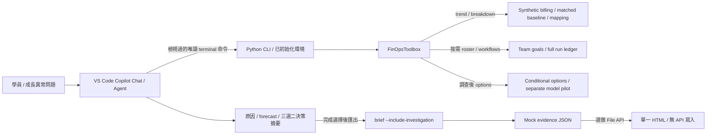
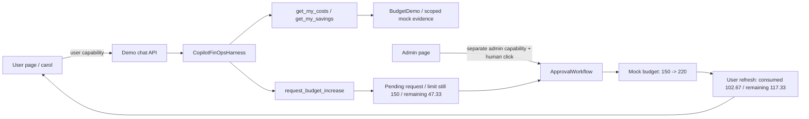
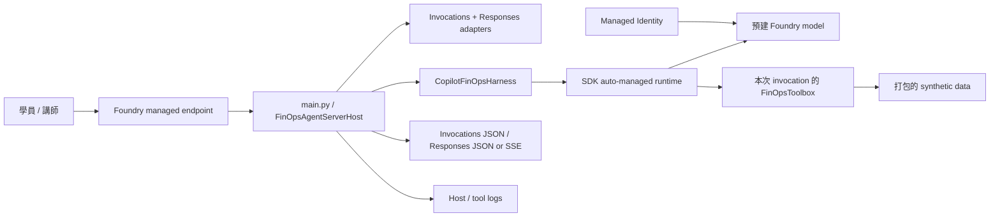

# FinOps Agent 架構與信任邊界

**Copilot SDK 是 Agent harness；Foundry Model 是可替換的模型來源，Foundry Agent Service 則是選配 hosting。** 本機可先切換模型，不需部署 Agent。Direct code deployment 不需要維護自訂 Dockerfile、sidecar 或 CLI TCP server；SDK 仍會自管其必要的 runtime process，並非完全移除了 runtime。

## Lab 1：IDE Agent 按證據選擇現成唯讀工具

Lab 1 由 repo-local [調查 skill](../.github/skills/finops-investigation/SKILL.md) 提供長指令與工具目錄：在 VS Code 開啟 repo 根目錄、Agent 模式呼叫 `/finops-investigation`，無須全域安裝。Deterministic CLI 只需要 Python 3.13、`PYTHONPATH` 與 mock fixtures，支援 `python -S`，不載入 SDK／Azure client。IDE skill 不是權限沙箱，也不是 Python SDK tool calling；仍須檢視唯讀命令，Ask 備案則由人逐次執行、貼回結果。

Lab 1 用 **terminal tool history** 的實際命令與回應作為可見執行證據。選配 SDK／Hosted 的 `tool_calls` 是另一個 execution surface，不代表 deterministic CLI 需要新的顯示旗標或 SDK 認證。

先看 daily growth，再查 user/model、按需取團隊／workflow；最高用量只是一個 lead。`trend` 不載入 roster／workflow／pilot，不洩漏原因；`options` 要在分析工作量與成功成果後才呼叫。一般 `brief` 不 eager-load 業務脈絡；只有 `--include-investigation` 才為**決策後**保存完整調查回應。

### CLI、SDK 與資料來源對照

| CLI | 一般 mock SDK tool | 資料／邊界 |
| --- | --- | --- |
| `trend` | `get_daily_usage_trend()` | current billing + 獨立 `usage-comparison.json` baseline；每日序列、summary、change、department_changes，沒有業務原因 |
| `departments` | `rank_department_consumption()` | 當期 billing + 財務 mapping；保留 Unallocated |
| `breakdown --dimension user` 或 `model`，可加 `--department '<部門>'` | `break_down_usage(...)` | 依部門縮小查詢範圍，不憑人名猜成本中心 |
| `roster '<部門>'` | `get_team_roster(department)` | `team-roster.json` 指定團隊；members、目標、成功定義與剩餘工作，不是真實 org lookup |
| `workflows '<部門>' --limit 6` | `get_workflow_evidence(department, limit)` | `workflow-runs.json` 兩期完整 ledger；全量 summary、by_user／by_workflow + 有界 samples，limit 1..20 |
| `forecast 600` | `forecast_budget(...)` | 歷史 MTD 線性 run-rate，回 projected_month_end_quantity／projected_month_end_amount；不是工作計畫保證 |
| `options` | `compare_improvement_options()` | 按需取得 roster／runs／`model-pilots.json`；反事實／未來估算／headroom 分開，無 plan、approval 或寫入 |

Trend、roster、workflows、options 的 SDK 對應**只註冊在一般 mock SDK toolset**；real adapter 不捏造 baseline 或業務資料。通用 CLI `ask`／`chat` 可供講師示範相同名稱的 SDK tools，seat planning 與 console `/approve` 仍是進階範例，不是 Lab 1 唯讀能力或 Lab 2 必做。Lab 2 只透過 `demo_connection.py` 接自己的三個個人工具，不能把這張表整包交給 user model。

Workflow 回應的 `summary`、`by_user`、`by_workflow` 覆蓋該團隊該期所有驗證過的 runs；`returned_runs`、`total_runs`、`truncated` 標明 sample 範圍，不能把六筆加總當全期。完整 ledger 按 date/user/model 對帳。`successful_tasks` 是不同 workflow/task/input_revision 成果；duplicate candidate 還需同成功 result_digest 和 model。失敗重試、revision 變更與不同模型輸出不自動是冗餘；實際變更須 owner 確認必要 checks，保留人工／合規 review。未知團隊、無資料或非法 limit 明確失敗，不回虛構零值。

## Lab 1 選做 dashboard：本機檔案，不是新服務

核心交付仍是決策摘要。完成後才匯出 `brief --include-investigation`，再以 IDE 的 [dashboard skill `/finops-dashboard`](../.github/skills/finops-dashboard/SKILL.md) 提議建立 `workshop-output/finops-dashboard.html`；已有檔案就換名稱。檢視 edits 後接受、手動開啟，不經 Lab 2 的 SDK harness，也不新增 Lab 或管理服務。

頁面只用 **File API** 讀取 JSON，資料留在頁面記憶體。單一 HTML 可由 `file://` 開啟，無網路、CDN、backend、登入、persistence 或管理操作；瀏覽器不持有 API key。Repo source 與 `.env` 不在編輯範圍，結果不自動執行或上傳。Clawpilot 樣式、安全呈現、鍵盤及錯誤狀態規則由 skill 提供。

`schema_version=2` 的 `investigation_evidence` 包含 daily_comparison、teams、workflows、options；普通 `brief` 缺此 section 時須加旗標重新匯出，不猜脈絡。各來源的期間／as_of、billing、budget、seat 與 run-rate 各自獨立，不能互相覆蓋；詳見 [evidence contract](../.github/skills/finops-dashboard/references/evidence-contract.md) 與 [資料說明](../data/README.md)。

## Lab 2：個人 FinOps 與管理者核准

`BudgetDemo` 將 user 固定在伺服器端；model 沒有任意 username、plan payload 或 approve 參數。Allowlist **只有** `get_my_costs`、`get_my_savings`、`request_budget_increase`。`get_my_costs` 只回傳 carol 的 billing、budget 與申請；`get_my_savings` 只使用她的 evidence，不提供其他團隊的 roster／workflow。管理者核准是另一個 HTTP endpoint，不是 LLM tool。

`demo_server.py` 只綁 localhost，產生不同的 user/admin capabilities，以 request header 驗證；更改 UI role 不會繞過伺服器檢查。這是單一機器的角色扮演，並非 production 登入或多租戶 RBAC。持有 admin link 代表管理者，因此不要公布該連結或把頁面公開。

同一個 demo process 保留 SDK conversation、mock budgets、pending requests；頁面輪詢只讀這些資料，不重新呼叫模型。核准前不改額度，核准後不重設 consumed；重複核准不再次執行，過時的 budget snapshot 拒絕核准。退出程序後一切重設。

`demo.html` 沒有前端 build 或外部 CDN；「直接提交 mock 申請」是明確標示、不經模型的備援，不是默默替代 SDK 問答。Lab 3 模型切換沿用這個本機 UI；選配 Hosted 部署不包含 UI 或 approval API。

## Foundry Model：只替換推論來源

`FINOPS_MODEL_PROVIDER` 的三條路徑都由既有 `CopilotFinOpsHarness` 管理，沒有新增 Toolbox／MCP 連線。`copilot` 使用 `COPILOT_GITHUB_TOKEN`／`COPILOT_MODEL`，是 Lab 2 的 Azure-free SDK 主線；Lab 1 IDE Chat 使用 VS Code 登入，不是這個 provider 設定。Foundry 則統一讀取 `AZURE_OPENAI_ENDPOINT`／`MODEL_NAME`：key 模式另需 `AZURE_OPENAI_API_KEY`；identity 模式不用 key，透過非同步 bearer-token callback，在本機使用開發者憑證、Hosted 使用 Managed Identity。

Endpoint 可以是 resource/project 根網址，或已包含 `/openai/v1/` 的 base URL；harness 只補一次 v1 路徑。Hosted 的 `MODEL_NAME` 由 azd deployment 變數對應，未指定 endpoint 時保留平台注入的 project endpoint 作為來源。舊 key 設定僅用於相容遷移，不和部分新 key 設定混用。

切換 provider 不增加工具或擴大 user scope，模型仍不能核准。Process 啟動後不做 live model switch，需停止並重啟 demo；舊 conversation、mock requests 與角色 capabilities 不會延續。身分、連線錯誤會明確回報，不偷偷改用 Copilot。

GitHub billing fixture 是被分析的資料；Azure inference 是 Agent 自己產生的費用，兩者分開。`FINOPS_BACKEND=mock` 與 `FINOPS_ALLOW_REAL_WRITES=false` 在換模型時不變。

## Foundry：相同 harness，獨立 request state

`azure.yaml` 選擇 `host: azure.ai.agent`、`runtime: python_3_13`、`entryPoint: main.py`，同時宣告 `responses` 與 `invocations`。`FinOpsAgentServerHost` 依 SDK 的 cooperative inheritance 組合 `InvocationAgentServerHost` 與 `ResponsesAgentServerHost`，共用同一個 listener 與 readiness。YAML 的 `container.resources` 是平台執行資源大小，不表示需要另一個自建 container。

Invocations 接收 `{"input":"..."}`，保留原本的 JSON contract 與 503／504 失敗 status。Responses 接收文字／文字 message list，供 Playground 使用；SDK 產生標準 Responses JSON 或 SSE。模型完整回答後才輸出文字；失敗／逾時回傳 `status=failed`／`response.failed`，不會在 model error 後輸出 completed。Responses HTTP 200 不等於模型成功。

兩條路徑都呼叫同一個 local harness helper，限定每次純文字 1–8,000 字元及 150 秒 timeout。每次 request 各自建立 mock client、session、toolbox 和 runtime state，完成／取消後清理；Responses 只讀本次輸入，不載入 conversation history。這是簡化的 workshop 隔離方案，不提供跨 request memory 或 remote approval。

## 模型、資料、寫入權限分開

| 能力 | 認證／控制 | 不代表 |
| --- | --- | --- |
| Lab 2 使用者／管理者角色 | 本機啟動期不同 capabilities；核准需人點擊 | 正式 GitHub／Entra 登入或 real org 寫入權限 |
| Lab 1 Copilot Chat 分析 | VS Code GitHub 登入、人工檢視唯讀 terminal 命令；Ask 逐次貼結果為備案 | SDK 已完成接線、IDE 強制 allowlist 或 GitHub org API 權限 |
| Lab 1 選做 dashboard | Copilot Agent 建檔需既有登入；開頁後 File API 選取 mock JSON | 網頁需要模型 key、可呼叫管理 API 或為新服務 |
| 個人 Copilot model calling | `COPILOT_GITHUB_TOKEN` | GitHub organization billing 管理權限 |
| BYOK model calling | API key 或 Managed Identity | Foundry hosting 已部署 |
| Real organization billing read adapter | instructor CLI、最小權限 token | 允許寫入 |
| Real write | write flag + payload policy + human approval | 模型能自己核准 |
| Foundry hosted sample | 每次請求獨立、固定 mock backend | production 多租戶授權或 durable audit |

Python SDK runtime 維持 `enable_skills=False`、`mode="empty"`，只允許明確註冊的 custom tools；repo 的 `.github/skills/` 只供 VS Code IDE 使用，不改變 SDK roles／allowlist。**此隔離敘述不套用到 IDE Agent**。GitHub billing/admin credential 不傳給 SDK child environment；model provider credential 與管理 API credential 是不同秘密。

## Approval 與資料生命週期

Lab 2 模型只提交提高限額申請；管理者頁面顯示 user、current → requested 與 reason，人點擊後才核准。進階 CLI 則用完整確認字串。Token 綁定 plan 指紋、有期限，對錯誤 token、過期 token 或改過的 plan 都拒絕；重複執行同一個有效 plan 不再次呼叫 backend。

Mock seats、budgets、plans、audit 都只存在目前程序。稽核事件記錄操作階段，不包含 tokens。真實遠端 API 的 exactly-once 與 distributed concurrency 並未由本範例保證；遠端回應遺失需人工核對，不能盲目重試。

`temporary_budget` 只是唯讀提案；人須確認 scope、限額、hard stop 及 review／expiry。Budget fixture 的 `expires_at` 9/30 是 mock metadata，不是 production 自動回復／timer；它與 approval token 本身的有效期限是不同概念。Lab 2 的 localhost approval API 不部署成 Foundry 或 production 授權服務。

## 費用與證據口徑

Synthetic files 是**內部 normalized schema**，不是可原封不動代入 GitHub API 的 response。Billing amount、net credits、原始 tokens 不能混為一談；fixture 單價為教學用，不是 GitHub 公告價格。

快照固定為 `2026-09-22T23:59:59Z`，MTD 是 2026-09-01～2026-09-22，合計 **34,906.67 credits／USD 329.12**。所有日期預先模擬，不是實測、經驗證的預測或季節性證據。

Billing coverage 為 2026-08-26～2026-09-22、`sparse_training_samples`，8 月只有 8/31 carol 300 credits／USD 3，且不計入 9 月；缺日未知、不補零。9 月每天有樣本不保證真實帳務完整，`missing_dates` 有缺日就斷線。28 天 user metrics 使用獨立視窗，不與 MTD 混用。

獨立 `usage-comparison.json` 的 baseline 為 2026-08-01～2026-08-22、`as_of=2026-08-22T23:59:59Z`，21,523.33 credits／USD 188.25；兩個 22 日視窗的成長為 13,383.33 credits（62.18%）／USD 140.87（74.83%）。普通 billing `previous_month` 不支援。原始彙總後計算差額，與顯示值相減可能差 0.01。

`team-roster.json` 定義工作目標與成功尺度；`workflow-runs.json` 解釋 AI Lab 80 → 200 成功批次、每批 USD 0.953333 不變，以及 Security 30 → 60 runs、仍 30 個成功 PR revisions。`model-pilots.json` 的 20-task matched pilot 不進 billing；只支持 simple-maintenance 小範圍同品質假設，不推算 token 或 credit savings。這些不是 production 事實，也不能用不同任務比較員工績效。

原始資料保留小數精度，先加總再顯示兩位小數，並附 `rounding_note`。模型 credits 顯示值相加為 34,906.66、部門金額為 USD 329.13，最多 0.01 的四捨五入差異不能改寫全體 **34,906.67／329.12**；gross credits 減 discount credits 的顯示值也可能差 0.01。

Organization budget 的限額／已用／剩餘為 **600／331.47／268.53**；carol 為 **150／102.67／47.33**，人核准後才是 **220／102.67／117.33**。不要以 billing 329.12 取代 budget snapshot。USD 600 run-rate 情境為 **47,600 AI credits／USD 448.80**（329.12 ÷ 22 × 30），`projected_over_budget=false`；其目前餘額 600 − 329.12 = 270.88 也不是組織實際剩餘 268.53。

carol 的 60 個剩餘 migration 批次估計 USD 61.60、個人合計 164.27 是 plan-based estimate，不等於組織歷史 forecast。提高限額的 USD 70 是 headroom，節省為 0。A/B 剩餘期 USD 9.63／5.65 可在 disjoint cohorts、同期間與品質假設成立時合計 15.28，不加歷史反事實機會或 headroom。完整契約與 seat 反例見 [資料說明](../data/README.md)。

部門 mapping 是已解析的 cost-center/organizer 歸屬。Teams 可以重疊，不能直接當財務成本中心。無法歸屬的用量保留 `Unallocated`，含 real totals 與已知使用者報表之間的 residual。

Real billing endpoint 回傳的是報表，不是即時 meter；`retrieved_at` 不等於 provider 的資料更新時間。Usage metrics 只能支持採用率或效率假設，不應用來評分個人生產力，也不能保證 token 節省。

## 官方參考

- [VS Code Agent Skills](https://code.visualstudio.com/docs/agent-customization/agent-skills)
- [Copilot SDK 與官方範例](https://github.com/github/copilot-sdk)
- [SDK isolation / multi-tenancy](https://github.com/github/copilot-sdk/blob/main/docs/setup/multi-tenancy.md)
- [SDK Foundry model provider / BYOK](https://github.com/github/copilot-sdk/blob/main/docs/auth/byok.md)
- [Foundry protocol adapters](https://learn.microsoft.com/azure/foundry/agents/how-to/add-protocol-adapter)
- [Foundry code deployment](https://learn.microsoft.com/azure/foundry/agents/quickstarts/quickstart-deploy-own-code)
- [GitHub AI-credit billing usage](https://docs.github.com/en/rest/billing/usage)
- [Copilot usage report APIs](https://docs.github.com/en/rest/copilot/copilot-usage-metrics)
- [Seat management（文件標示 public preview）](https://docs.github.com/en/rest/copilot/copilot-user-management)
- [Budget API](https://docs.github.com/en/rest/billing/budgets)
- [User / organization budget 語意](https://docs.github.com/en/copilot/concepts/billing/budgets-for-usage-based-billing)

## 課程範圍

Lab 1 以成長異常、工作量／成果與三選二為主線，seat 與 Unallocated 是會計限制／延伸查核；可選做同 evidence 的單一 HTML dashboard。本課程使用 mock tools、人工核准流程、Foundry model provider 與選配 direct-code hosting；不加入 Toolbox、檢索、正式 SSO、跨組織同步或即時帳務資料。
