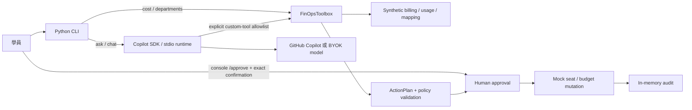
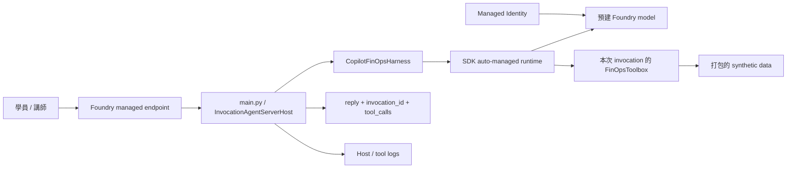

# FinOps Agent 架構與信任邊界

**Copilot SDK 是 Agent harness；Foundry 是 hosting。** Direct code deployment 不需要維護自訂 Dockerfile、sidecar 或 CLI TCP server；SDK 仍會自管其必要的 runtime process，並非完全移除了 runtime。

## 本機：先建立 tools，再讓模型選擇工具

Lab 1 的 deterministic CLI 不載入 Copilot 或 Azure client；只需要 Python 與 fixture。Lab 2 則增加 SDK model calling、instructions、schemas 和 tool handlers。CLI `chat` 在同一個 conversation 保留 toolbox 狀態；`ask` 是獨立一次問答。

## Foundry：相同 harness，獨立 request state

`azure.yaml` 選擇 `host: azure.ai.agent`、`runtime: python_3_13`、`entryPoint: main.py`、`protocol: invocations`。YAML 的 `container.resources` 是平台執行資源大小，不表示需要另一個自建 container。

`main.py` 接收 `{"input":"..."}`，以同一個 local harness 完成呼叫，回傳 JSON。失敗／逾時回傳非成功 HTTP status，不會在 model error 後輸出 completed。每次 request 各自建立 session、toolbox 和 runtime state，完成後清理；這是簡化的 workshop 隔離方案，不提供跨 request memory 或 remote approval。

## 模型、資料、寫入權限分開

| 能力 | 認證／控制 | 不代表 |
| --- | --- | --- |
| 個人 Copilot model calling | `COPILOT_GITHUB_TOKEN` | GitHub organization billing 管理權限 |
| BYOK model calling | API key 或 Managed Identity | Foundry hosting 已部署 |
| Real GitHub read adapter | instructor CLI、最小權限 token | 允許寫入 |
| Real write | write flag + payload policy + human approval | 模型能自己核准 |
| Foundry hosted sample | 每次請求獨立、固定 mock backend | production 多租戶授權或 durable audit |

Runtime 採 `mode="empty"`，只允許明確註冊的 custom tools；不讀取工作目錄的任意 hooks、skills 或 host Git 設定。GitHub billing/admin credential 不傳給 SDK child environment；model provider credential 與管理 API credential 是不同秘密。

## Approval 與資料生命週期

模型只建立 plan。可信的 console command 顯示 kind、target、payload，要求完整確認字串後才發出 approval capability。Token 綁定 plan 指紋、有期限，對錯誤 token、過期 token 或改過的 plan 都拒絕；重複執行同一個有效 plan 不再次呼叫 backend。

Mock seats、budgets、plans、audit 都只存在目前程序。稽核事件記錄操作階段，不包含 tokens。真實遠端 API 的 exactly-once 與 distributed concurrency 並未由本範例保證；遠端回應遺失需人工核對，不能盲目重試。

## 費用與證據口徑

Synthetic files 是**內部 normalized schema**，不是可原封不動代入 GitHub API 的 response。Billing amount、net credits、原始 tokens 不能混為一談；fixture 單價為教學用，不是 GitHub 公告價格。

部門 mapping 是已解析的 cost-center/organizer 歸屬。Teams 可以重疊，不能直接當財務成本中心。無法歸屬的用量保留 `Unallocated`，含 real totals 與已知使用者報表之間的 residual。

Real billing endpoint 回傳的是報表，不是即時 meter；`retrieved_at` 不等於 provider 的資料更新時間。Usage metrics 只能支持採用率或效率假設，不應用來評分個人生產力，也不能保證 token 節省。

## 官方參考

- [Copilot SDK 與官方範例](https://github.com/github/copilot-sdk)
- [SDK isolation / multi-tenancy](https://github.com/github/copilot-sdk/blob/main/docs/setup/multi-tenancy.md)
- [Foundry invocations adapter](https://learn.microsoft.com/azure/foundry/agents/how-to/add-protocol-adapter)
- [Foundry code deployment](https://learn.microsoft.com/azure/foundry/agents/quickstarts/quickstart-deploy-own-code)
- [GitHub AI-credit billing usage](https://docs.github.com/en/rest/billing/usage)
- [Copilot usage report APIs](https://docs.github.com/en/rest/copilot/copilot-usage-metrics)
- [Seat management（文件標示 public preview）](https://docs.github.com/en/rest/copilot/copilot-user-management)
- [Budget API](https://docs.github.com/en/rest/billing/budgets)
- [User / organization budget 語意](https://docs.github.com/en/copilot/concepts/billing/budgets-for-usage-based-billing)
